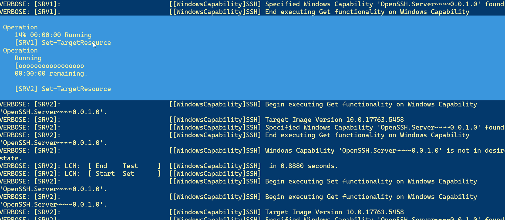

# Introduction to Desired State Configuration

This document is intended to provide a brief overview to Desired State Configuration (DSC). DSC is not a product you install or download. It is a management framework that leverages PowerShell. DSC is just one of many configuration management tools you might encounter. Products such as Chef, Puppet, and Terraform also fall into this category.

## The Role of Configuration Management

When we talk about *configuration management*, we are really talking about *infrastructure from code*. Instead of using **imperative** processes such as scripts to configure infrastructure such as a server, we use a **declarative** approach. We don't write code to implement a configuration, we write a description of the desired configuration. Often, these configurations are written in JSON. The configurations are "deployed" to the targets and implemented at the target. The configuration design, deployment, and implementation will vary by tooling.

## DSC v2

DSC was introduced with Windows PowerShell v4.0. It was updated again with Windows PowerShell 5.0. Today, you can use DSC v2.0 on Windows servers. All systems should be running Windows PowerShell 5.1. If you work with DSC, you need to take the approach that is is a *framework*. There will be a lot of tooling that you will have to build, often using PowerShell, if you want to manage your environment with DSC.

Your approach to DSC follows a multi-step process.

- Authoring phase (local)
- Staging phase (MOF)
- Deployment (remote)

In the authoring phase, you will create the DSC configuration script. This script is actually declarative. Even though you use PowerShell's scripting language, the script will define your desired configuration. You will use this script to define configurations for one or more servers.

When the script is invoked, it will create a set of intermediate MOF files. You will use these files to deploy the configuration to the remote machines.

When you need to update the configuration, update the script, regenerate the MOF files and redeploy. You can build tooling and testing to automate this process.

### DSC Resources

At the heart of your configuration script will be the use of `DSC Resources`. These are special PowerShell modules that are responsible for implementing the configuration. Any resource must be installed on your authoring box, usually your Windows 10/11 desktop, and the remote server.

#### Built-In

Windows PowerShell ships with several out-of-the-box resources that will handle a lot of your common configuration needs.

```powershell
PS C:\> Get-DscResource -module PSDesiredStateConfiguration |select ImplementedAs,Name,Properties

ImplementedAs Name                      Properties
------------- ----                      ----------
       Binary File                      {DestinationPath, Attributes, Checksum, Contents...}
   PowerShell Archive                   {Destination, Path, Checksum, Credential...}
   PowerShell Environment               {Name, DependsOn, Ensure, Path...}
   PowerShell Group                     {GroupName, Credential, DependsOn, Description...}
    Composite GroupSet                  {DependsOn, PsDscRunAsCredential, GroupName, Ensure...}
       Binary Log                       {Message, DependsOn, PsDscRunAsCredential}
   PowerShell Package                   {Name, Path, ProductId, Arguments...}
    Composite ProcessSet                {DependsOn, PsDscRunAsCredential, Path, Credential...}
   PowerShell Registry                  {Key, ValueName, DependsOn, Ensure...}
   PowerShell Script                    {GetScript, SetScript, TestScript, Credential...}
   PowerShell Service                   {Name, BuiltInAccount, Credential, Dependencies...}
    Composite ServiceSet                {DependsOn, PsDscRunAsCredential, Name, StartupType...}
   PowerShell User                      {UserName, DependsOn, Description, Disabled...}
   PowerShell WaitForAll                {NodeName, ResourceName, DependsOn, PsDscRunAsCredential...}
   PowerShell WaitForAny                {NodeName, ResourceName, DependsOn, PsDscRunAsCredential...}
   PowerShell WaitForSome               {NodeCount, NodeName, ResourceName, DependsOn...}
   PowerShell WindowsFeature            {Name, Credential, DependsOn, Ensure...}
    Composite WindowsFeatureSet         {DependsOn, PsDscRunAsCredential, Name, Ensure...}
   PowerShell WindowsOptionalFeature    {Name, DependsOn, Ensure, LogLevel...}
    Composite WindowsOptionalFeatureSet {DependsOn, PsDscRunAsCredential, Name, Ensure...}
   PowerShell WindowsPackageCab         {Ensure, Name, SourcePath, DependsOn...}
   PowerShell WindowsProcess            {Arguments, Path, Credential, DependsOn...}
```


You can run `Get-DSCResource` without any parameters to see all installed resources.

#### Installing Resources

You can install additional resources from the PowerShell Gallery. With experience you will learn what resources you need. You can use `Find-DscResource` to discover them. Because the resource is packaged as a module, use `Install-Module` to install it.

#### DSC Resource Syntax

In order to use the resource in your configuration, you will need to know its properties, or syntax.

```powershell
PS C:\> Get-DscResource Service -Syntax
Service [String] #ResourceName
{
    Name = [string]
    [BuiltInAccount = [string]{ LocalService | LocalSystem | NetworkService }]
    [Credential = [PSCredential]]
    [Dependencies = [string[]]]
    [DependsOn = [string[]]]
    [Description = [string]]
    [DisplayName = [string]]
    [Ensure = [string]{ Absent | Present }]
    [Path = [string]]
    [PsDscRunAsCredential = [PSCredential]]
    [StartupType = [string]{ Automatic | Disabled | Manual }]
    [State = [string]{ Running | Stopped }]
}
```

Required properties are not enclosed in brackets. In this example, the `Name` property is required. Everything else is optional and the syntax also shows you valid values.

In your configuration script, you will define the resource, assigning it a unique name.

```powershell
Service RemoteRegistry {
    Name = "RemoteRegistry"
    State = "Stopped"
    StartUpType = "Disabled"
}

Service WSMan {
    Name = "wsman"
    State = "Running"
    StartUpType = "Automatic"
    Ensure = "present"
}
```

### DSC Configuration

You will define your configuration in a PowerShell script file using the `Configuration` keyword.

```powershell
Configuration MemberServer {
    Param(
    [Parameter(Position=0,Mandatory)]
    [string[]]$ComputerName
    )
```

This is not a function so you do not need to follow the Verb-Noun naming convention. This will create a new type of command called a `configuration`. You should still use a meaningful name. Your configuration can also include parameters.

#### Import DSC Resources

At the beginning of your configuration, import the DSC resource modules that you will be using.

```powershell
#built-in
Import-DSCResource -ModuleName 'PSDesiredStateConfiguration' -ModuleVersion '1.1'
#installed
Import-DSCResource -ModuleName 'ComputerManagementDSC' -ModuleVersion  '9.0.0'
```

It is possible to have multiple versions of the same resource so I always specify the version I want.

#### Nodes

Next you need a `Node` configuration for each server you wish to configure. You can hard-code computer names, but I'd suggest using parameters.

```powershell
Node $Computername {
    #configuration settings go here
}
```

> I am trying to keep this simple. There are many things you can do with nodes, especially once you dive into using configuration data. That's a rabbit hole we will avoid for now.

#### Settings

Within the node, define your configuration settings using the DSC resources.

```powershell
File CorpData {
    DestinationPath = 'C:\CorpData'
    Ensure          = 'Present'
    Type            = 'Directory'
}

File CorpDataReadme {
    DestinationPath = 'C:\CorpData\readme.txt'
    Ensure = 'Present'
    Type = 'File'
    Contents = "This folder is for corporate reporting files."
    #this resource has a dependency on another setting that must
    #be set first. DSC will handle ordering the configuration
    DependsOn = "[File]CorpData"
}

WindowsFeature PSv2 {
    Name   = 'PowerShell-V2'
    Ensure = 'Absent'
}
```

If you edit your configuration in the PowerShell ISE or Visual Studio Code, you should get tab-completion for the resource settings.

## Running the Configuration

When you script is complete, dot source the script file. This will give you a new command in your Windows PowerShell session.

```powershell
PS C:\> Get-Command MemberServer

CommandType     Name                                       Version    Source
-----------     ----                                       ------    ------
Configuration   MemberServer
```

Run the configuration to generate the MOF files.

```powershell
PS C:\training\OnRamp\2024\session-material\Intro-to-DSC> MemberServer -ComputerName srv1,srv2


    Directory: C:\training\OnRamp\2024\session-material\Intro-to-DSC\MemberServer


Mode                 LastWriteTime         Length Name
----                 -------------         ------ ----
-a----         4/16/2024   3:11 PM           6360 srv1.mof
-a----         4/16/2024   3:11 PM           6360 srv2.mof
```

You can specify the output location, otherwise, the files will be created in a sub-folder named after the configuration. You don't have to do anything with the MOF files. Do not edit them. If you need to recreate them, update your configuration code and re-run the configuration.

## Deploying the Configuration

To deploy the configuration, use `Start-DSCConfiguration`. The target nodes must have PowerShell remoting enabled and support connecting via CIMSessions. By default, the command will run as a background job. I recommend you run it using `-Wait` and `-Verbose` so that you can see that is happening. You can deploy all servers with defined MOFs or by individual server.

```powershell
Start-DscConfiguration -Path .\MemberServer\ -Verbose -Wait
```



Depending on what you are configuring, there may be time required for the configuration to converge and complete. You can use the `Test-DscConfiguration` and `Get-DscConfiguration` to check the status of the remote server's configuration. Don't like what you have? Update the configuration and re-deploy.

The point of DSC, and configuration management in general, is to treat your servers like cattle, not pets. Years ago, I had someone tell me that they worked at a place that relied on DSC and they had an extensive monitoring framework. They had a guideline that if the server's configuration drifted, they assumed it was breached. They would take the server offline and spin up a replacement using DSC, within minutes. That's the power of configuration management.

## DSC v3

Microsoft is working on a new version of DSC. It is still in the early stages so I'm not going to cover it. I know there will be fundamental changes to how things will be implemented, although the basic concepts remain unchanged. If you would like to know more about DSC v3, you can checkout the [GitHub repository](https://github.com/PowerShell/DSC).

## Summary

I have used DSC for years, and still do today. Yes, it only works with Windows PowerShell, but it still gets the job done, as long as you are willing to get your hands dirty with a little PowerShell scripting.
